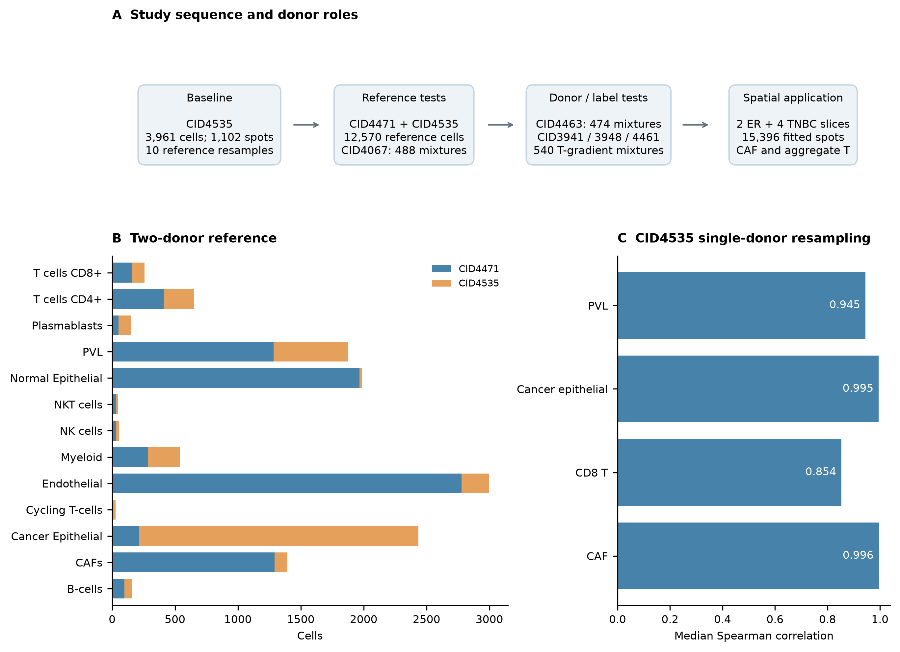
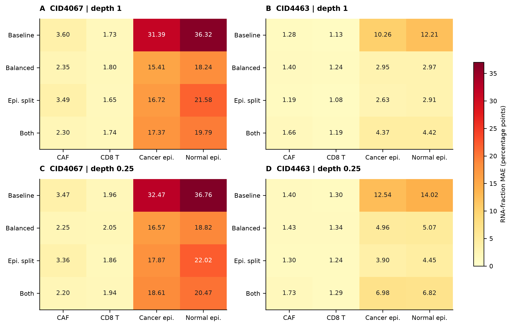
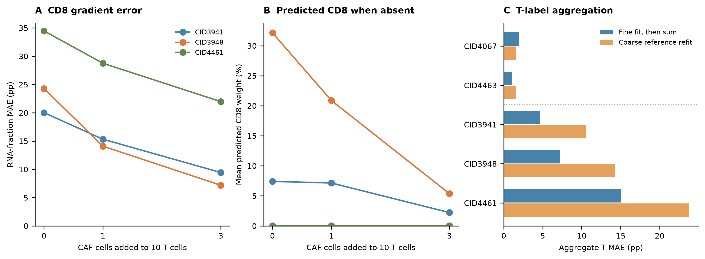
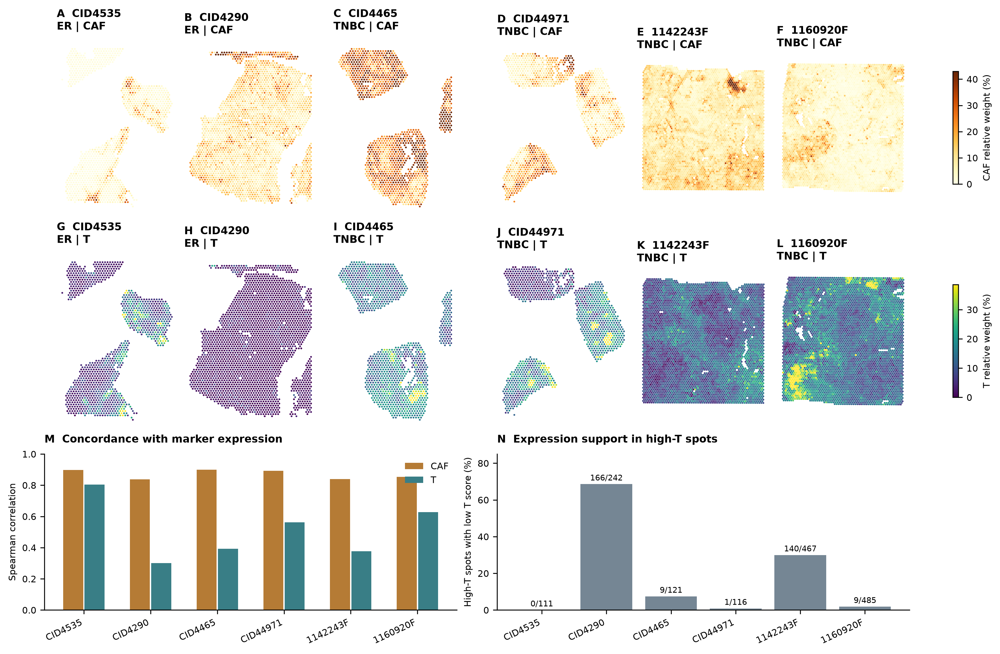

# 乳腺癌空间反卷积的参考构建、供者验证与 CAF/T 细胞分布

## 摘要

本项目基于 Wu 等公开的乳腺癌单细胞与空间转录组数据，从 CID4535 出发，建立参考整理、RCTD 反卷积、重抽样及已知组成测试流程，并扩展至六张空间切片。CID4535 单供者参考的 10 次重抽样中，CAF 和 CD8 T 细胞空间排序相关中位数分别为 0.996 和 0.854。进一步采用 CID4471 与 CID4535 的 12,570 个细胞构建参考，发现供者平衡与上皮标签拆分能够改变癌上皮和正常上皮的分配，但 CD8 估计仍随供者及 CAF 背景变化。五名测试供者中，四名的 T 细胞总量估计在细分标签拟合后汇总时优于直接合并参考标签。按该方案完成六张切片、15,396 个 spot 的拟合后，CAF 与 marker 表达的相关系数为 0.837–0.900，T 细胞为 0.301–0.804。现有结果显示，CAF 空间信号较一致，T 细胞信号的表达支持存在明显切片差异。

**关键词：** 乳腺癌；空间转录组；RCTD；单细胞参考；CAF；T 细胞

## 1. 引言

乳腺癌组织中肿瘤、基质与免疫细胞的分布共同构成局部微环境。单细胞测序提供细胞类型及状态信息，空间转录组保留表达信号的组织位置。Wu 等的乳腺癌图谱同时提供计数、分层注释与空间病理信息，为两类数据的联合分析提供了基础 [1]。

Visium spot 接收多种细胞的 RNA，需要借助参考表达特征分解其组成。RCTD 在模型中处理单细胞与空间测序的平台差异 [3]，实际预测也取决于参考供者、标签粒度及混合背景。本项目围绕三个问题展开：CID4535 的预测是否随参考抽样保持稳定；已知组成下哪些类型容易发生分配偏移；经过标签比较后，CAF 与 T 细胞信号能否在多张切片中得到一致的表达支持。

## 2. 材料与方法

### 2.1 数据与参考构建

单细胞数据来自 [GSE176078](https://www.ncbi.nlm.nih.gov/geo/query/acc.cgi?acc=GSE176078)，空间数据来自 [Zenodo 4739739](https://zenodo.org/records/4739739)，供者亚型与治疗信息结合原文补充表核对。CID4535 为未经治疗的 ER+ 浸润性小叶癌。初始分析保留其 3,961 个细胞和 22,061 个表达基因，使用 Scanpy 归一化、选择 3,000 个高变基因并计算 UMAP [2]。

参考沿用作者注释，将 T/NK 相关标签展开为 CD4、CD8、NK、NKT 和 Cycling T，形成 13 类。后续加入同为未经治疗 ER+ 浸润性小叶癌的 CID4471，共 12,570 个细胞。比较完整参考、按类型平衡供者、按作者 LumA/LumB 等标签拆分癌上皮，以及两者结合四种方案。平衡后参考含 3,799 个细胞；Cycling T 因细胞数较少保留原有 27 个。拆分后的上皮结果汇总回原始大类比较。

### 2.2 反卷积与已知组成测试

RCTD 使用 spacexr 的 full 模式、2 个核心和随机种子 9，参考最低 UMI 为 100。初始单供者分析每类最低细胞数为 15，双供者阶段为 25。原始权重保存后，按 spot 权重总和归一化，用于相对组成比较；误差以百分点表示。NNLS 作为对照，特征选择仅使用参考数据。

CID4067 构成开发测试集，244 个基础混合在原深度和 25% 深度下生成 488 个模拟 spot。四种方案确定后，在保留供者 CID4463 上评估 474 个模拟 spot，包含 CAF/CD8 混合、纯细胞对照和正常/癌上皮梯度。另以 CID3941、CID3948、CID4461 分别构建 T 梯度：每组 10 个 T 细胞中 CD8 为 0、2、5、8 或 10 个，其余为 CD4，再加入 0、1 或 3 个 CAF，连同纯对照共生成 540 个模拟 spot。CAF 背景比较保留相同的 T 细胞及其抽稀计数。

主要指标为预测相对权重与实际捕获 RNA 比例之间的平均绝对误差（MAE），细胞数比例另行保存。不同深度共享基础配方，同一供者细胞可用于多个配方，结果按供者、场景及深度分别计算。五名供者合计 1,502 个模拟 spot 进一步用于标签汇总比较；CID4463 在前一阶段承担保留验证，后续参与方案比较。

### 2.3 稳定性与空间表达比较

CID4535 单供者参考按类型有放回抽样 10 次，每类数量保持不变，比较排序相关和高值 spot 保留率。多切片分析固定双供者完整参考，以 13 类拟合后将 CD4、CD8、NKT 和 Cycling T 相加，定义本报告的汇总 T 权重；NK 单独保留。

六张切片统一排除作者 Artefact 或组织外 spot，15,611 个输入 spot 经质控保留 15,399 个，模型实际拟合 15,396 个。四张切片使用 15,770 个模板基因，1142243F 与 1160920F 使用实测交集中的 15,581 个。表达评分由完整空间计数归一化至每 spot 10,000、log1p 后取 marker 均值：T 使用 CD3D/E/G、TRAC、TRBC1/2，CAF 使用 COL1A1/A2、DCN、LUM。计算评分与权重的 Spearman 相关，并统计权重前 10% spot 中评分不高于切片第 25 百分位的数量。

## 3. 结果

### 3.1 从单供者稳定性分析扩展至双供者参考

CID4535 包含 2,223 个癌上皮细胞、102 个 CAF 和 396 个 T-cells 大类细胞，空间质控后保留 1,102 个 spot。10 次参考重抽样中，CAF 的排序相关中位数为 0.996，CD8 为 0.854；两者高值 spot 保留率中位数分别为 95.5% 和 80.2%。CAF 主要空间模式对本轮抽样较稳定，CD8 局部预测更敏感。双供者参考扩大了细胞覆盖，同时呈现正常上皮、内皮等类型在供者间的数量差异（图 1）。



**图 1｜分析路线与参考组成。** A，阶段及供者用途，模拟 spot 数包含两种深度。B，双供者参考按原始 13 类汇总的细胞数。C，CID4535 单供者参考 10 次重抽样相对初始拟合的排序相关中位数。

### 3.2 参考调整改变上皮分配，CAF/CD8 误差变化较小

CID4067 原深度混合场景中，基线 RCTD 的 CAF/CD8 RNA 比例 MAE 为 3.60/1.73 个百分点，NNLS 为 4.21/4.24。该供者配方中不含正常上皮，RCTD 却分配了平均 36.32% 的正常上皮权重，癌上皮 MAE 为 31.39；合并两类上皮后 MAE 为 5.56，主要偏移发生在上皮内部。

供者平衡后，癌上皮 MAE 降至 15.41，正常上皮误分配降至 18.24%；拆分上皮后分别为 16.72 和 21.58%。CID4463 保留验证的混合场景中，基线癌上皮 MAE 为 10.26，平衡和拆分后为 2.95 和 2.63；CAF/CD8 仍保持较低误差（图 2）。但在正常/癌上皮梯度中，正常上皮 MAE 由基线 16.39 增至拆分后的 21.33，参考调整对不同背景的作用并不相同。



**图 2｜参考方案对 RNA 比例误差的影响。** A、C 为 CID4067，B、D 为 CID4463；上排原深度，下排 25% 深度。每格为 MAE，面板共享色阶。Balanced 为供者平衡，Epi. split 为上皮拆分，Both 为两者结合。每个深度分别含 189 和 162 个混合 spot，纯对照及上皮梯度另见结果表。

### 3.3 CD8 误差依赖供者与背景，支持拟合后汇总 T 细胞

T 梯度揭示了低比例混合测试未充分覆盖的误差。无 CAF 时，CID3941、CID3948 和 CID4461 的基线 CD8 MAE 为 20.02、24.29 和 34.48 个百分点；加入 3 个 CAF 后为 9.43、7.18 和 21.97。真实 CD8 为零时，CID3948 的平均预测仍为 32.15%，加入 CAF 后降至 5.38%（图 3）。CAF 背景可以改变 CD8 分配，预测 CD8 随 CAF 增加而减少的现象本身不能解释为细胞排斥。

进一步比较汇总 T 权重，三名供者的细分拟合后汇总 MAE 为 4.68、7.18 和 15.10，合并参考重拟合则为 10.60、14.27 和 23.77。五名供者中四名在前一种方案下误差较低，25% 深度保持相同方向。因此，多切片分析保留细分参考拟合，再报告汇总 T 分布。



**图 3｜CD8 背景敏感性与 T 标签汇总。** A，不同 CAF 背景下的 CD8 MAE。B，真实 CD8 为零时的平均预测。C，两种 T 汇总方案；虚线区分前两名供者的 CAF/CD8 混合场景与后三名的 T 梯度场景。全部为原深度 RCTD 结果，各供者按自身配方计算。

### 3.4 六张切片的 CAF 信号较一致，T 信号存在切片差异

双供者参考应用于两张 ER 和四张 TNBC 切片后，CAF 与 marker 的相关系数为 0.837–0.900，T 为 0.301–0.804（图 4）。CID4535 的 CAF/T 相关为 0.898/0.804；与旧单供者拟合相比，CAF/T 权重排序相关仍为 0.980/0.959，主要空间结构保持一致。

CID4535 的 111 个高 T spot 中没有低 T 评分 spot，CID4290 为 166/242，1142243F 为 140/467。CID4290 的这 166 个 spot 均未检测到所选六个 T marker，预测主要来自 Cycling T 与 CD4 分量。空间结果因而同时报告预测分布和表达对应关系。去除 Cycling T 后，部分切片相关升高，另一些降低，未形成一致改善。

| 切片 | 作者亚型 | 拟合 spot | CAF 表达相关 | T 表达相关 | 高 T 中低 T 评分 spot |
|---|---|---:|---:|---:|---:|
| CID4535 | ER | 1,102 | 0.898 | 0.804 | 0/111 |
| CID4290 | ER | 2,419 | 0.837 | 0.301 | 166/242 |
| CID4465 | TNBC | 1,207 | 0.900 | 0.392 | 9/121 |
| CID44971 | TNBC | 1,159 | 0.892 | 0.562 | 1/116 |
| 1142243F | TNBC | 4,662 | 0.839 | 0.377 | 140/467 |
| 1160920F | TNBC | 4,847 | 0.853 | 0.628 | 9/485 |

表中相关系数均在单张切片内计算。1142243F 质控后保留 4,665 个 spot，其中 3 个在模型预处理阶段被移除。六张切片使用固定的 ER 双供者参考，TNBC 结果描述该参考在不同亚型组织中的应用表现。



**图 4｜空间分布与表达对应。** A–F 为 CAF，G–L 为汇总 T；点按组织像素坐标排列，各面板独立缩放。同一细胞类型共享六张切片合并 spot 的第 99 百分位色阶上限，超出值显示为最深色。M 为权重与对应 marker 评分的 Spearman 相关。N 为高 T spot 中低 T 评分的比例，标注数量/高 T 总数；低评分阈值包含并列值。

## 4. 讨论

本轮分析从参考抽样稳定性推进到已知组成和多切片比较。CAF 在初始重抽样及空间表达对应中呈现较一致的表现，CD8 则随供者和背景明显变化。两类结果回答不同问题：重复拟合的稳定性描述参考扰动后的变化，已知组成测试进一步揭示估计与真实 RNA 组成之间的偏离。

上皮参考调整降低了部分混合场景的误差，但作用并不一致。原参考的 LumA/LumB 状态分别集中于不同供者，供者组成与细胞状态共同影响表达特征。T 标签比较表明，先保留细分表达特征再汇总，有助于当前多数供者的总 T 估计。由此形成的多切片结果以 CAF 和汇总 T 为主线，结合 marker 表达描述局部信号。

## 5. 数据与复现

本文图组从已保存结果表重绘，提供 300 DPI PNG、PDF、面板数据及输入 SHA-256 清单。旧 CID4535 图组继续保留。

| 分析环节 | 脚本入口 | 结果入口 |
|---|---|---|
| 初始参考与重抽样 | [参考准备](src/sc_sncell_github/prepare_reference.ipynb)、[重抽样](src/sc_sncell_github/rctd_reference_bootstrap.R) | [CID4535 图组](results/CID4535_paper_v1) |
| 已知组成测试 | [构建配方](src/sc_sncell_github/build_known_composition.py) | [测试汇总](results/Wu2021_known_composition_v1/benchmark_summary.md) |
| 四种参考比较 | [参考构建](src/sc_sncell_github/build_reference_comparison.py) | [结果表](results/Wu2021_reference_comparison_v1/key_metrics.csv) |
| 保留供者验证 | [准备验证](src/sc_sncell_github/prepare_independent_validation.py) | [指标表](results/Wu2021_independent_validation_v1/validation_metrics.csv) |
| T 梯度与标签比较 | [T 梯度](src/sc_sncell_github/prepare_tcell_validation.py)、[标签汇总](src/sc_sncell_github/prepare_coarse_tcells.py) | [梯度指标](results/Wu2021_tcell_validation_v1/gradient_metrics.csv)、[汇总指标](results/Wu2021_coarse_T_v1/T_cell_key_metrics.csv) |
| 六切片空间分析 | [准备](src/sc_sncell_github/prepare_multislice_spatial.py)、[拟合](src/sc_sncell_github/run_multislice_spatial.R)、[评估](src/sc_sncell_github/evaluate_multislice_spatial.py) | [切片汇总](results/Wu2021_multislice_CAF_T_v1/completed_slice_summary.csv) |
| 本文图组 | [绘图脚本](src/sc_sncell_github/make_wu2021_stage_paper_figures.py) | [图与来源数据](results/Wu2021_stage_paper_v1)、[来源清单](results/Wu2021_stage_paper_v1/manifest.json) |

已有结果齐备后，在项目根目录执行：

```bash
.venv/bin/python src/sc_sncell_github/make_wu2021_stage_paper_figures.py
```

## 参考文献

1. Wu SZ, Al-Eryani G, Roden DL, et al. A single-cell and spatially resolved atlas of human breast cancers. *Nature Genetics*. 2021;53:1334–1347. [doi:10.1038/s41588-021-00911-1](https://doi.org/10.1038/s41588-021-00911-1).
2. Wolf FA, Angerer P, Theis FJ. SCANPY: large-scale single-cell gene expression data analysis. *Genome Biology*. 2018;19:15. [doi:10.1186/s13059-017-1382-0](https://doi.org/10.1186/s13059-017-1382-0).
3. Cable DM, Murray E, Zou LS, et al. Robust decomposition of cell type mixtures in spatial transcriptomics. *Nature Biotechnology*. 2022;40:517–526. [doi:10.1038/s41587-021-00830-w](https://doi.org/10.1038/s41587-021-00830-w).
