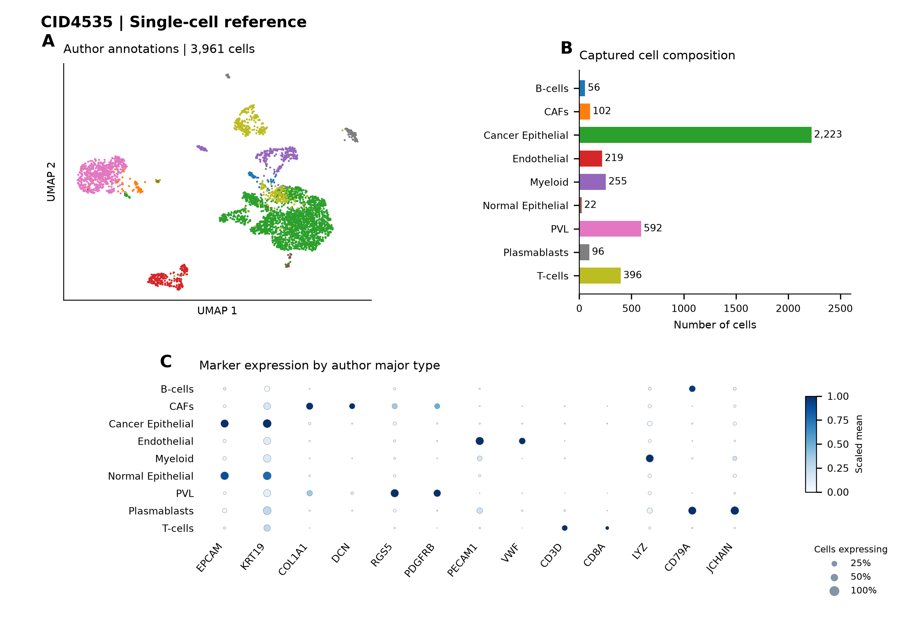
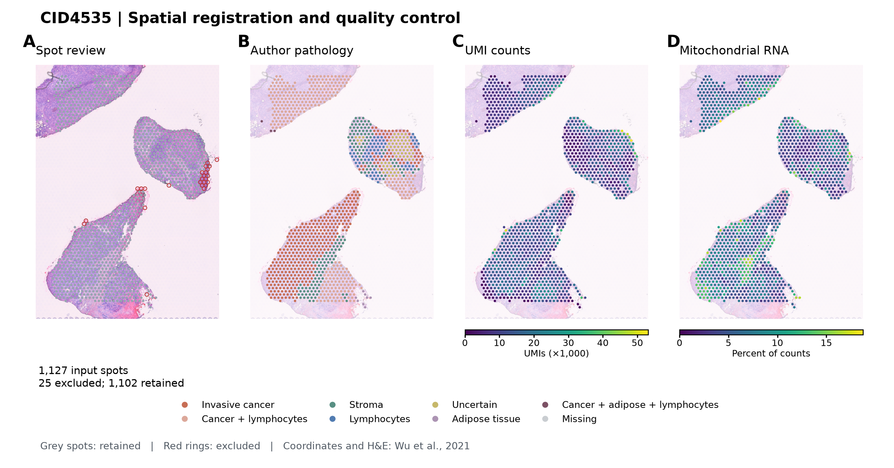
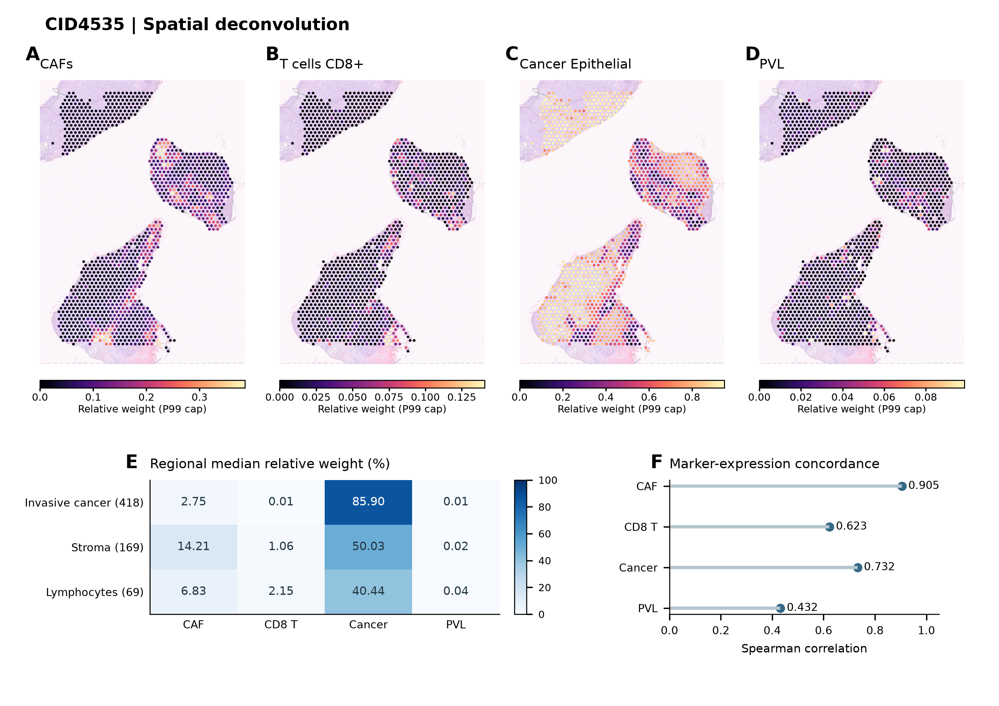
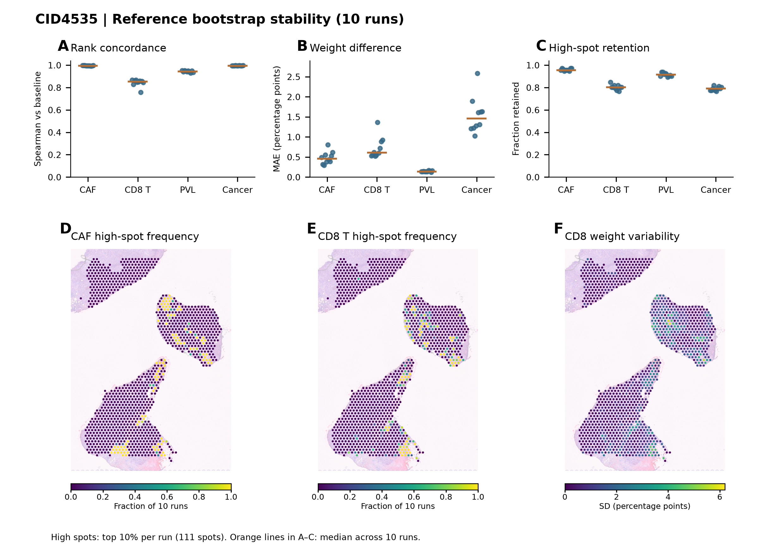

# CID4535 乳腺癌单细胞参考构建、空间反卷积及稳定性分析

## 摘要

乳腺癌组织中的癌上皮、基质与免疫细胞具有不同的空间分布。本项目使用 Wu 等公开的 CID4535 单细胞及 Visium 数据，建立从作者注释、空间质控到 RCTD 反卷积的分析流程，并通过参考细胞重抽样检查预测稳定性。单细胞分析保留 3,961 个细胞和 22,061 个表达基因；空间分析保留 1,102 个 spot。基于 13 类参考标签的反卷积显示，癌上皮权重在较大范围内占优，CAF 在间质相关区域升高，CD8 T 细胞呈局部富集。10 次重抽样中，CAF 与 CD8 的空间排序相关中位数分别为 0.996 和 0.854，高值 spot 保留率分别为 95.5% 和 80.2%。结果显示，CAF 的主要空间模式在参考变化后保持一致，CD8 的局部权重与高值位置对参考抽样更敏感。

**关键词：** 乳腺癌；单细胞转录组；空间转录组；RCTD；CAF；CD8 T 细胞

## 1. 引言

乳腺癌组织由肿瘤细胞及多种基质、免疫细胞共同构成。单细胞测序可以区分细胞类型和状态，空间转录组则保留了表达信号在组织中的位置。Wu 等建立了乳腺癌单细胞与空间图谱，为两类数据的联合分析提供了计数矩阵、分层细胞注释和病理信息 [1]。

Visium 的一个 spot 可以同时接收多种细胞的 RNA。将单细胞表达特征作为参考进行反卷积，可以进一步描述混合信号的组成。RCTD 在学习参考细胞类型特征的同时，处理单细胞与空间测序之间的平台差异 [3]。参考如何构建，也会影响后续的空间预测。

本报告选择 CID4535 作为分析对象，围绕两个问题展开：作者注释下的主要细胞群在空间上如何分布；更换抽到的参考细胞后，CAF 和 CD8 的高值区域是否保持一致。分析依次包括单细胞参考整理、空间数据质控、反卷积及重抽样稳定性检查。

## 2. 材料与方法

### 2.1 数据来源

CID4535 为 ER+ 浸润性小叶癌样本，原论文临床补充表记录其治疗状态为 Naïve [1]。单细胞计数和作者三级注释来自 [GSE176078 / GSM5354538](https://www.ncbi.nlm.nih.gov/geo/query/acc.cgi?acc=GSM5354538)，空间计数、坐标、H&E 图像和病理标签来自 [Zenodo 4739739](https://zenodo.org/records/4739739)。以细胞或 spot 条码连接表达矩阵与元数据，分别保存原始计数和后续分析对象。

### 2.2 单细胞处理与参考标签

使用 Scanpy 1.12.4 完成单细胞分析 [2]。保留作者发布的全部 3,961 个细胞，去除未在任何细胞中表达的基因。每细胞计数归一化至 10,000 后进行 log1p 转换，选择 3,000 个高变基因，计算 50 个主成分，以前 30 个主成分和 15 个邻居构建邻居图。Leiden 分辨率设为 0.5，随机种子为 0，UMAP 的 min_dist 为 0.5。

作者的 major、minor、subset 标签原样保留。按 major 分组进行 Wilcoxon marker 检验和 BH 校正，并用 marker 点图检查表达特征。反卷积参考沿用主要细胞类型，将 T-cells 展开为 CD4 T、CD8 T、NK、NKT 和 Cycling T，共形成 13 类标签；CAF 与 PVL 各自保留为总群。

### 2.3 空间质控与反卷积

按条码对齐空间计数、全分辨率像素坐标、图像缩放系数及作者病理标签，通过组织叠图检查空间位置 [4]。排除 23 个作者标记的 Artefact spot 和 2 个组织外 spot；组织内缺失病理标签的 1 个 spot 保留表达数据。记录 UMI、检测基因数和线粒体计数比例，本轮未追加这些指标的数值过滤。

单细胞与空间对象共有 15,770 个基因，按同一顺序输入 RCTD。采用 spacexr 1.2.0 的 `createRctd()` 和 `runRctd()`，参考最低 UMI 为 100，每类最低参考细胞数为 15，使用 full 模式和 2 个 CPU 核心。基线预处理后空间对象含 2,794 个基因，其中 1,354 个用于反卷积回归。

原始权重单独保存，绘图时将每个 spot 的权重除以该 spot 的权重总和，得到相对权重。各细胞类型空间图以自身第 99 百分位为颜色上限。区域比较采用作者标签下的权重中位数；marker 表达组合由空间 counts 每 spot 归一化至 10,000、log1p 转换后取指定基因均值，再计算与预测权重的 Spearman 相关。

### 2.4 参考重抽样

在每种参考类型内部进行有放回抽样，每类抽取数量与原来相同，共 10 次，抽样种子为 1001–1010。每轮预处理与拟合前设种子 9，空间输入、标签和参数保持一致，方法内部重新筛选基因。

分别比较每次结果与基线的 Spearman 相关、平均绝对差异（MAE）及高值 spot 保留率。高值集合固定取权重前 10%，即 111 个 spot；同值按条码排序。逐 spot 统计重复权重的标准差与进入高值集合的频率。这里的频率表示 10 次抽样中的出现次数，MAE 和标准差以相对权重的百分点表示。

## 3. 结果

### 3.1 单细胞参考覆盖主要肿瘤、基质与免疫细胞群

过滤后单细胞对象包含 22,061 个基因，Leiden 共形成 16 个聚类。按作者大类统计，癌上皮细胞为 2,223 个，占捕获细胞的 56.1%；PVL、T-cells、髓系和内皮细胞分别为 592、396、255 和 219 个，CAF 为 102 个。T/NK 相关细分类中，CD4 T 为 239 个，CD8 T 为 98 个，NK、NKT 和 Cycling T 分别为 25、15 和 19 个。

UMAP 中可观察到主要细胞群的表达结构（图 1A）。上皮群表达 EPCAM、KRT19，CAF 表达 COL1A1、DCN，PVL 中 RGS5、PDGFRB 较突出，内皮、髓系和 T 细胞群分别显示相应 marker 特征（图 1C）。作者标签与表达检查共同构成了本轮参考整理的依据。



**图 1｜单细胞参考的组成与表达特征。** A，按作者 major 标签着色的 UMAP。B，各类捕获细胞数量，颜色与 A 一致。C，作者大类的 marker 点图；点面积表示检测到该基因的细胞比例，颜色表示按基因缩放至 0–1 的群平均 log 表达。细胞类别名称沿用作者注释。

### 3.2 空间计数与组织位置完成对齐

空间输入含 1,127 个 spot 和 19,237 个基因，重新计算的 UMI 和检测基因数与作者记录逐 spot 一致。待排除 spot 主要位于组织碎片边缘（图 2A），过滤后保留 1,102 个 spot。

保留数据中，作者标记的浸润癌、癌伴淋巴细胞、间质和淋巴细胞区域分别包含 418、361、169 和 69 个 spot，其余为 Uncertain、脂肪、混合区域及缺失标签。计数深度和线粒体比例在组织内呈现位置差异，为后续权重分布提供了质量背景（图 2C、D）。



**图 2｜空间数据对齐与质量控制。** A，保留 spot 以灰色显示，25 个排除 spot 以红圈标出。B，作者病理分类。C，保留 spot 的 UMI 数。D，线粒体计数比例。各面板使用相同坐标范围，H&E 与坐标来自 Wu 等公开数据。

### 3.3 癌上皮占优区域与局部基质、免疫信号形成空间差异

RCTD 为全部 1,102 个 spot 输出了 13 类权重。跨 spot 的平均相对权重中，癌上皮为 68.9%，CAF 为 7.28%，CD8 T 为 1.40%，PVL 为 0.90%。癌上皮在左上组织块和下方组织块左侧较大范围内占优；CAF 在中间组织块的左上及下侧、下方组织块尖端和下缘形成局部高值区域。CD8 高值更为零散，在中间组织块下侧和下方组织块右下侧较明显。PVL 则表现为分散的小范围信号（图 3A–D）。

按病理区域汇总，CAF 在间质中的相对权重中位数为 14.21%，高于浸润癌区域的 2.75%；CD8 在淋巴细胞区域和间质中的中位数分别为 2.15% 和 1.06%。癌上皮在浸润癌区域的中位数为 85.90%，在间质和淋巴细胞区域也存在表达贡献（图 3E）。

配套的 marker 表达检查显示，CAF 权重与 COL1A1、COL1A2、DCN、LUM 组合的相关为 0.905，癌上皮与 EPCAM、KRT8、KRT18、KRT19 组合的相关为 0.732。CD8 和 PVL 与各自表达组合的相关分别为 0.623 和 0.432（图 3F）。



**图 3｜细胞类型相对权重的空间分布。** A–D，CAF、CD8 T、癌上皮及 PVL 权重，各图采用独立的 P99 色阶上限。E，三个主要病理区域的中位数，括号为 spot 数。F，同一空间表达矩阵中的 marker 组合与权重相关；CD8 组合为 CD3D、CD3E、TRAC、CD8A、CD8B，PVL 组合为 RGS5、PDGFRB、MCAM、CSPG4。完整成图数据见 [figure3_marker_correlations.csv](results/CID4535_paper_v1/figure3_marker_correlations.csv)。

### 3.4 CAF 高值位置保持稳定，CD8 对参考抽样更敏感

10 次拟合均保留 1,102 个 spot 和 13 类标签。CAF 与基线的排序相关中位数为 0.996，MAE 为 0.462 个百分点，高值 spot 保留率为 95.5%。基线的 111 个 CAF 高值 spot 中，102 个在至少 8 次重复中仍处于前 10%（图 4）。

CD8 的对应指标为 0.854、0.609 个百分点和 80.2%，其中 76 个基线高值 spot 在至少 8 次重复中仍为高值。单看基线 CD8 高值集合，其跨重复标准差中位数为 2.42 个百分点，变化集中在部分局部富集区域。PVL 的高值保留率为 91.4%；癌上皮的整体排序相关达到 0.995，最高值集合保留率为 79.3%。

| 类型 | 排序相关中位数 | MAE 中位数（百分点） | 前 10% 高值保留率 |
|---|---:|---:|---:|
| CAF | 0.996 | 0.462 | 95.5% |
| CD8 T | 0.854 | 0.609 | 80.2% |
| PVL | 0.945 | 0.138 | 91.4% |
| 癌上皮 | 0.995 | 1.462 | 79.3% |



**图 4｜10 次参考重抽样的稳定性。** A–C，每轮相对基线的排序相关、MAE 与高值 spot 保留率，每个点代表一次运行，橙线为中位数。D、E，CAF 和 CD8 进入前 10% 高值集合的频率。F，CD8 相对权重的跨重复标准差。稳定性比较的来源表见 [metrics_by_run.csv](results/CID4535_reference_bootstrap_v1/metrics_by_run.csv)。

## 4. 讨论

CID4535 的单细胞参考与空间反卷积形成了相互衔接的表达描述：癌上皮贡献在组织中广泛存在，CAF 与 CD8 的高值则更集中于局部位置。CAF 在作者间质区域中的权重升高，同时与基质相关表达组合一致，说明这一空间模式具有病理分类和表达信息的共同支持。

重抽样进一步区分了细胞类型之间的稳定性。CAF 的高值位置在重复运行中较少变化，CD8 则同时保留了一批持续出现的高值 spot 和一批对参考抽样敏感的位置。因而，对 CD8 的描述需要同时关注局部富集位置与权重波动。癌上皮的大范围分布虽然一致，最高值 spot 的名次仍可变化，提示整体模式与极高值集合应分别评价。

CAF 和 CD8 在部分区域共同升高，全切片相关为 +0.610，重抽样后为 +0.569 至 +0.689。这个结果描述的是混合表达背景下两类相对权重的共同变化。现有图组将区域分布、表达对应和参考敏感性放在同一分析框架中，使局部富集的位置及其在重复分析中的变化得到共同呈现。

## 5. 数据与复现

计数矩阵、作者标签、坐标和组织图像来自上述公开数据入口。正文数值由已保存对象与结果表重新核对，组合图从底层数据重绘，输出 PDF 和 300 DPI PNG。图 1、3、4 为 210 × 148.5 mm，图 2 为 210 × 110 mm。

| 分析环节 | 文件入口 |
|---|---|
| 单细胞处理 | [read_data.ipynb](src/sc_sncell_github/read_data.ipynb) |
| 空间数据质控 | [read_spatial.ipynb](src/sc_sncell_github/read_spatial.ipynb) |
| 参考准备 | [prepare_reference.ipynb](src/sc_sncell_github/prepare_reference.ipynb) |
| RCTD 拟合 | [run_rctd.R](src/sc_sncell_github/run_rctd.R) |
| 参考重抽样 | [rctd_reference_bootstrap.R](src/sc_sncell_github/rctd_reference_bootstrap.R) |
| 稳定性结果解读 | [inspect_reference_bootstrap.ipynb](src/sc_sncell_github/inspect_reference_bootstrap.ipynb) |
| 本文组合图与来源数据 | [CID4535_paper_v1](results/CID4535_paper_v1) |

已有结果齐备后，可在项目根目录重绘本文图组：

```bash
.venv/bin/python src/sc_sncell_github/make_cid4535_paper_figures.py
```

软件版本、参数及抽样条码随各阶段结果保存；[图形来源清单](results/CID4535_paper_v1/figure_data_manifest.json)记录本次使用的对象及校验值。[Python 脚本说明](docs/python_scripts.md)和[完整技术路线](docs/technical_route.md)保留为操作入口。

## 参考文献

1. Wu SZ, Al-Eryani G, Roden DL, et al. A single-cell and spatially resolved atlas of human breast cancers. *Nature Genetics*. 2021;53:1334–1347. [doi:10.1038/s41588-021-00911-1](https://doi.org/10.1038/s41588-021-00911-1).
2. Wolf FA, Angerer P, Theis FJ. SCANPY: large-scale single-cell gene expression data analysis. *Genome Biology*. 2018;19:15. [doi:10.1186/s13059-017-1382-0](https://doi.org/10.1186/s13059-017-1382-0).
3. Cable DM, Murray E, Zou LS, et al. Robust decomposition of cell type mixtures in spatial transcriptomics. *Nature Biotechnology*. 2022;40:517–526. [doi:10.1038/s41587-021-00830-w](https://doi.org/10.1038/s41587-021-00830-w).
4. Palla G, Spitzer H, Klein M, et al. Squidpy: a scalable framework for spatial omics analysis. *Nature Methods*. 2022;19:171–178. [doi:10.1038/s41592-021-01358-2](https://doi.org/10.1038/s41592-021-01358-2).
