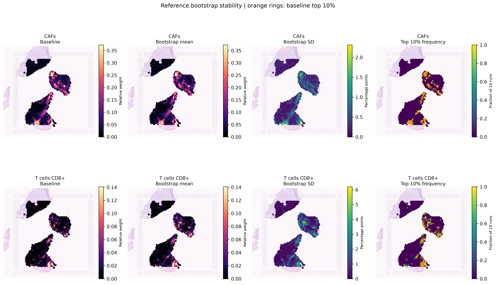
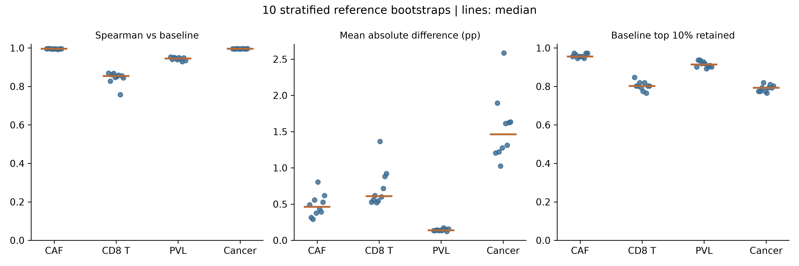

# CID4535 参考重抽样结果解读

## 1. 本次完成了什么

对同一个CID4535参考进行10次按细胞类型分层的有放回重抽样。每类抽取原有数量，空间输入、13类标签和模型参数保持不变。10次均成功输出1102个spot，输入文件MD5全部一致。

R脚本为 [rctd_reference_bootstrap.R](../src/sc_sncell_github/rctd_reference_bootstrap.R)，过程和成图见已执行的 [inspect_reference_bootstrap.ipynb](../src/sc_sncell_github/inspect_reference_bootstrap.ipynb)。原基线没有覆盖。

## 2. 权重与空间位置是否稳定

以下是10次相对基线的指标中位数。MAE的单位是归一化相对权重的百分点，不是细胞数量误差。前10%固定为111个spot，保留率表示这一批spot有多少仍在每轮前10%。

| 类型 | Spearman | MAE（百分点） | 前10% spot保留率 | 基线高值spot在至少8/10次仍为高值 |
|---|---:|---:|---:|---:|
| CAF | 0.996 | 0.462 | 95.5% | 102/111 |
| CD8 T | 0.854 | 0.609 | 80.2% | 76/111 |
| PVL | 0.945 | 0.138 | 91.4% | 95/111 |
| 癌上皮 | 0.995 | 1.462 | 79.3% | 71/111 |

### 2.1 CAF

CAF的整体排序与高值区域都比较稳定。中间组织块左上、下侧，以及下方组织块尖端、下缘和右下附近的高值模式，在基线与重抽样平均图中保持相似。基线111个高值spot中，98个在全部10次都进入前10%，102个至少在8次进入。

作者间质区域的CAF权重中位数在各次为12.94%—14.02%，浸润癌区域为2.36%—2.76%。这支持当前参考下间质区域CAF相对权重较高这一描述，没有因为换一批抽样细胞而消失。

### 2.2 CD8 T

CD8具有可重复的高值位置，但波动比CAF大。图中下方组织块右下侧与尖端、中间组织块下侧等位置仍有重复出现的高值点。不是所有原始高值spot都可靠：基线111个高值spot中，53个每次都在前10%，76个至少在8次进入，14个不到一半次数进入。

全体spot的MAE中位数为0.609个百分点，看起来不大，但大量接近零的spot会拉低这个平均值。只看基线前10%的111个CD8高值spot，其跨重复标准差中位数为2.42个百分点，最大为6.20个百分点。因此可以保留局部富集的描述，但不宜把某个spot的单次权重当作精确比例。

CD8前5%高值集合的保留率中位数仅73.2%，前20%为81.2%。这进一步说明最强信号的具体名次仍会变化。

### 2.3 PVL与癌上皮

PVL前10%位置保留率为91.4%，说明同参考内部的位置比此前仅看弱色阶时更稳定。但是重复预测稳定不能证明与内皮等血管相关细胞的区分准确，原来的marker特异性问题仍需单独检查。

癌上皮整体排序非常稳定，基线和平均图的大块高权重区域一致。前10%保留率只有79.3%，但这些基线高值spot的跨重复标准差中位数仅0.53个百分点，前20%保留率提高到91.4%。这符合大范围高权重区域内部的小幅变化导致最高名次更替，不能单凭前10%重合较低认定整体空间定位不稳定。

## 3. CAF与CD8的关系是否改变

基线全切片Spearman相关为+0.610，10次重抽样为+0.569—+0.689，全部保持正相关。当前的全切片共同变化方向不依赖某一次参考抽样。

这不是CAF促进或排斥CD8的结论。该数值仍受癌上皮占优区域、组成约束与空间结构影响；本轮没有定义独立的肿瘤—间质边界，也没有估计患者层面效应。

## 4. 同时发现的小群体问题

全部13类都进行了统计。Cycling T的Spearman中位数仅0.693，MAE为1.609个百分点，平均偏移的中位数为−1.397个百分点，比CAF明显不稳定。CD4、NK、NKT的排序相关中位数分别约0.817、0.751、0.778。后续扩展参考时，T/NK相关标签的可区分性应重点复核；本轮没有按这些结果修改或合并标签。

## 5. 怎样理解这次稳定性

本轮支持CAF空间模式的参考内部稳定性，也识别出CD8中一批重复出现的高值spot。它不能给出准确率：10次都来自同一个供者，且bootstrap会重复使用细胞，每类独立来源细胞数见逐轮unique_cells_by_type.csv。

输入共同基因相同，但createRctd每轮重新选择拟合基因。基线拟合基因为1354个，重复为1563—1885个，集合Jaccard为0.566—0.702。因此这是完整参考构建与映射流程的重抽样敏感性，不是锁死基因特征后的单一参数扰动实验。10次观察范围不作为置信区间，高值出现频率不作为细胞存在概率。

按照原路线，下一阶段是扩展多供者参考并进行供者隔离的已知组成测试。当前CID4535可作为流程开发样本，暂不据此报告CAF—CD8边界效应。

## 6. 图与数据

- [逐轮指标](../results/CID4535_reference_bootstrap_v1/metrics_by_run.csv)
- [高值集合重合](../results/CID4535_reference_bootstrap_v1/high_spot_overlap.csv)
- [逐spot波动与高值频率](../results/CID4535_reference_bootstrap_v1/spot_stability.csv)
- [病理区域中位数](../results/CID4535_reference_bootstrap_v1/pathology_region_medians.csv)
- [模型运行记录](../results/CID4535_reference_bootstrap_v1/run_summary.csv)
