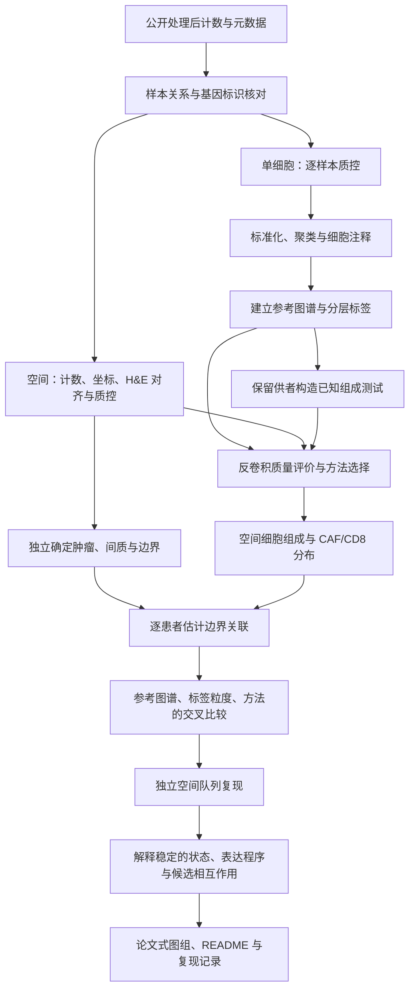

# 技术路线：CAF–CD8 空间关系的跨参考稳健性研究

## 1. 研究结构

**生物学问题：** 肿瘤—间质边界附近，CAF 的状态与分布，是否关联 CD8 T 细胞在两侧的相对分布？

**方法问题：** 更换参考图谱、细胞标签粒度或反卷积方法后，患者层面的关联方向、大小和不确定性是否改变？

先建立可靠的细胞识别与空间定位，再研究关联。判断结论是否成立，需要同时考虑预测质量、患者一致性和独立队列支持。

推荐以 R 为主要操作环境。如果更熟悉 Python，单细胞部分可以整体替换为 Scanpy；不需要重复两套同样的分析。

## 2. 总路线

图中各环节的软件注释如下。软件为建议选项，参数由你在实施时确定。

| 环节 | 推荐软件 | 用途 | 输出 |
|---|---|---|---|
| 数据读入与标识核对 | Seurat、Matrix；Python 可用 AnnData、h5py | 读取 MTX/H5，核对条码、基因和样本字段 | 保留原始 counts 的对象、样本清单 |
| 单细胞质控 | Seurat；可选 scDblFinder | 按样本查看 UMI、基因数、线粒体比例与双细胞候选 | QC 图、过滤记录 |
| 标准化、降维、聚类 | Seurat；必要时 Harmony 或 Seurat 整合流程 | 形成表达空间，检查批次与细胞状态 | PCA、UMAP、聚类 |
| 注释与参考构建 | Seurat marker 分析＋原作者标签＋文献 | 复核主要细胞群与 CAF/CD8 状态 | 标签、marker 证据、标签层级映射 |
| 空间对象与图像检查 | Seurat 空间接口、QuPath | 对齐表达、坐标与 H&E，查看或标注组织区域 | 切片 QC、病理分区 |
| 参考到空间的映射 | RCTD 起步；cell2location 作后续对照 | 估计多细胞 spot 中各类型的贡献或丰度 | 原生预测、汇总标签后的预测、诊断 |
| 已知组成评价 | R 的 nnls 或 SciPy NNLS；R/Python 统计工具 | 检查复杂模型是否超过简单对照，评价稀有类型 | 按供者、细胞类型分解的误差与检测表现 |
| 距离、邻接与区域分析 | R 的 sf、igraph；或 Squidpy | 构建边界距离、邻接、富集与共定位 | 带单位的空间指标 |
| 患者层面比较 | R 统计模型；需要时 lme4 或 metafor | 汇总患者效应，比较参考和方法变化 | 效应量、区间、患者一致性 |
| 生物学解释 | UCell/GSVA、clusterProfiler；可选 LIANA/CellChat | 表达程序评分、富集和候选通讯解释 | 有证据支持的候选过程 |
| 成图 | ggplot2、ComplexHeatmap、patchwork；或 Matplotlib | 绘制并组合可比较的图组 | PDF、PNG 与配套数据表 |

## 3. 数据如何分工

| 数据 | 计划角色 | 使用前需要确认 |
|---|---|---|
| Wu 2021 单细胞＋Visium | 复现、流程开发与初步空间分析 | 患者配对关系，作者标签与混合病理区域含义 |
| Pal 2021 单细胞 | 独立参考图谱候选 | 原发肿瘤、全细胞采样、治疗状态、重复样本、细胞注释 |
| Wang 2024 TNBC 空间队列 | 较大规模独立空间复现候选 | 患者纳入、阵列关系、未经批次校正的计数、病理区域字段 |
| Honda 2024 的四张新 Visium 切片 | 独立空间案例候选 | 亚型分别处理，补齐可用的病理边界标注 |

同一图谱按亚型拆成子集，属于参考组成敏感性分析，不能算多个独立图谱。同一患者的多张切片也不能算多个独立患者。下载状态见 [原始数据清单](../data/README.md)。

## 4. 单细胞与参考分析

### 输入

从作者已完成比对、定量的原始 counts 开始，不必重新下载 FASTQ。核对矩阵方向、非负整数计数、条码唯一性和元数据行序。患者、样本、亚型、平台、组织部位和治疗状态应分别记录。作者标签与新标签使用不同字段。

基因对齐应保留可追踪的标识。区分 Ensembl 版本号、基因符号中的小数点、软件去重产生的后缀；不能一律删后缀，也不能把不同来源未提供的基因直接补零。

### 处理与人工检查

逐样本查看质量分布，再决定过滤阈值。肿瘤样本不能直接照搬 PBMC 教程的参数。双细胞候选结合 marker 混合、细胞群与实验规模判断；环境 RNA 校正只在所需输入可用时考虑。

Seurat 起步包括标准化、高变基因、PCA、邻居图、聚类和 UMAP。LogNormalize 与 SCTransform 路线择一建立基线；是否整合、采用哪些批次字段，根据患者、疾病状态和技术批次的关系决定。[Seurat 官方教程](https://satijalab.org/seurat/articles/pbmc3k_tutorial)

整合用于辅助聚类与注释；反卷积仍保留其要求的原始 counts 输入，不用整合后的矩阵替代所有任务的 counts。

注释至少区分 CAF、CD8 T、CD4 T、NK/NKT、髓系、B/浆细胞、内皮、PVL、正常/癌相关上皮。不能把作者 `T-cells` 大类直接等同于 CD8，也不能只凭单个 ACTA2 信号区分 CAF 与血管相关细胞。上皮性质不清楚时，可将 CNV 推断作为补充证据。

### 标签粒度

先保留 CAF 总群与 CD8 总群，再分别探索 CAF 和 CD8 的细分状态。每个细分类都检查供者分布、每供者细胞数、marker 稳定性以及与相近类型的可分辨性；总细胞数多不等于跨供者支持充分。

建立“细分类 → 上级类”的映射。比较总 CAF–总 CD8 关联时，细分模型也汇总回同一总群；细分类自己的空间关系作为另一个问题报告。

## 5. 空间数据与病理边界

先核对 counts、spot 条码、坐标和图像缩放，再做空间分析。优先使用作者病理标注；需要自主标注时，用 QuPath 查看 H&E，记录标注依据和人工复核。

明确肿瘤、间质、原位癌、正常、坏死、淋巴聚集、伪影和混合区域如何处理。边界来自独立的形态或病理信息，不能先按“高 CAF、低 CD8”划区，再证明排斥。

只有粗糙 spot 标签时，可研究区域交界近似，但结论范围要与该分辨率一致。距离分析确认物理单位；邻接图避免跨组织空洞连边。每例是否有可用边界，应在关联检验前决定。

## 6. 反卷积与质量评价

先完成一个参考、一个标签层级、一种方法，再扩大组合。

**RCTD：** 检查原始 counts、UMI 定义、参考类别、基因筛选和适合多细胞 spot 的拟合模式，例如官方 full 模式。具体接口与参数以所安装版本为准。[官方说明](https://github.com/dmcable/spacexr)

**cell2location：** 分别建立参考表达模型与空间模型。预期每 spot 细胞数、检测相关参数、训练设置和收敛诊断需要有依据。[官方教程](https://cell2location.readthedocs.io/en/latest/notebooks/cell2location_tutorial.html)

评价分成两部分：

- **已知组成：** 按供者隔离训练与测试细胞，构造合理混合场景，分别评价细胞数量比例和 RNA 贡献比例。查看 MAE/RMSE、检测表现、稀有类型漏检/误检，并与简单对照比较。
- **真实空间：** 对照独立组织学、marker 和区域分布，检查异常、恒定预测及不确定性。H&E 的广义组织分类不是 CD8 亚群真值。

不能只凭重建误差、平滑图像、UMAP 或一个整体分数判断方法可靠。已有评价设计可参考 [Spotless](https://elifesciences.org/articles/88431)。

## 7. 患者层面的主要指标

先确定一个主要指标和少量敏感性分析，避免计算许多指标后只挑符合假说的结果。

| 问题 | 可考虑的量化方式 | 需要你确定的定义 |
|---|---|---|
| CD8 是否偏向边界某一侧 | 两侧区域对比、边界距离分布 | 两侧划分、邻域宽度、权重/丰度的汇总 |
| CAF 是否关联 CD8 分布 | 逐患者的关联效应或回归系数 | CAF 暴露、CD8 结局、协变量、空间结构 |
| 更换分析选择是否改变结论 | 患者效应之差、方向一致性、不确定性变化 | 共同患者、区域和最终标签定义 |
| 能否独立复现 | 外部患者效应方向、大小与异质性 | 平台尺度、纳入规则、复现判定 |

只有相对权重时，报告相对分布或富集；细胞密度需要细胞数和面积依据。CAF/CD8 比例关联可能受组成约束影响，应结合癌细胞比例、组织组成、深度等检查解释。

先逐患者估计效应，再按实际患者数和层级结构决定汇总模型。空间置换、区间估计和混合模型应保留相应的空间与患者结构，不把全部 spot 当作独立重复。[Squidpy 空间分析工具](https://squidpy.readthedocs.io/en/stable/)

## 8. 交叉比较与独立验证

| 维度 | 起步 | 扩展 |
|---|---|---|
| 参考 | 一个复核后的参考 | 独立图谱；同图谱组成压力测试 |
| 标签 | CAF/CD8 总群 | 分别细分 CAF、CD8，保留有支持的状态 |
| 方法 | RCTD | cell2location，简单基线辅助解释 |
| 空间数据 | 少量流程检查切片 | 完整开发队列，随后独立队列 |

优先一次改变一个维度，再考察交互影响。记录主要比较、共同评估范围、随机种子和方法内部必要处理。根据测试结果调过参数后，同一测试集不能继续充当独立验证。

外部复现前固定标签、基因对齐、边界、指标和纳入标准。多切片归属患者后再汇总。不同平台的分辨率需要对应到可比较的空间尺度。

## 9. 深挖与成图

目标细胞识别可信、关联有跨患者支持后，再研究 ECM、TGF-β、炎症或细胞毒性等表达程序。富集分析定义背景基因集；差异分析使用符合统计单位的设计。通讯预测作为候选解释，结合空间邻近与表达证据。

| 图组 | 内容 | 推荐工具 |
|---|---|---|
| 图 1 | 数据来源、纳入与逐样本 QC | ggplot2、patchwork |
| 图 2 | 细胞图谱、CAF/CD8 marker、标签层级 | Seurat、ComplexHeatmap |
| 图 3 | H&E、分区、边界与空间细胞分布 | QuPath、Seurat/Squidpy |
| 图 4 | 供者与细胞类型分解的模型质量 | ggplot2 或 Matplotlib |
| 图 5 | 患者效应及跨参考、粒度的稳定性 | 森林图、热图、配对图 |
| 图 6 | 独立复现与稳定信号的解释 | ggplot2、ComplexHeatmap |

导出 PDF 与 300 DPI PNG。通常使用 210 × 74.25 mm，复杂图组最多 210 × 148.5 mm。统一细胞颜色、标签与指标定义，比较图保持可比的坐标和色阶。

结论区分稳定结果、依赖特定分析选择的结果、因数据不足而无法判断的结果。数值在零附近换符号，不自动代表实质性的生物学结论反转。

本主题已有直接研究，项目定位为复现与增量评价。先前工作包括 [Honda 2024](https://www.thno.org/v14p1873.htm)、[Croizer 2024](https://www.nature.com/articles/s41467-024-47068-z) 和 [乳腺癌反卷积参考选择的公开研究](https://www.biorxiv.org/content/10.64898/2026.01.09.698566v1)。新的贡献由实际比较和独立验证支持。
