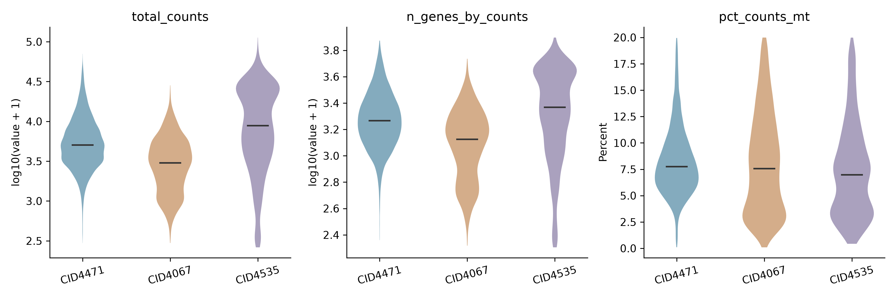
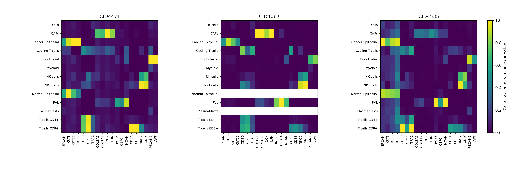

# 三例ER+供者的QC记录

## 1. 数据读取

从Wu全队列按条码提取CID4471、CID4067和CID4535，共16,334个细胞。原始矩阵为29,733个基因，重新计算的UMI和检测基因数与作者metadata逐细胞一致，线粒体比例差异小于6×10⁻¹⁴个百分点。

## 2. 处理前后数量

本轮沿用作者保留细胞，核对计数有效且UMI大于0。每例保留至少在1个细胞中表达的基因。

| 供者 | 处理前细胞 | 处理后细胞 | 保留基因 | 分布或共表达复核标记 |
|---|---:|---:|---:|---:|
| CID4471 | 8,609 | 8,609 | 24,528 | 301 |
| CID4067 | 3,764 | 3,764 | 21,512 | 71 |
| CID4535 | 3,961 | 3,961 | 22,061 | 540 |

三例检测基因数最小值分别为228、207和201，线粒体比例均低于20%。复核标记保存在每个细胞的obs中。

## 3. QC分布

| 供者 | UMI中位数 | 检测基因数中位数 | 线粒体比例中位数 |
|---|---:|---:|---:|
| CID4471 | 5,041 | 1,842 | 7.75% |
| CID4067 | 3,011 | 1,329.5 | 7.57% |
| CID4535 | 8,818 | 2,329 | 6.97% |

CID4535的癌上皮群有263个细胞被标记为低检测基因数，152个被标记为低UMI，两项有重叠。该样本的癌上皮UMI中位数为20,028，分布中同时存在计数较低的细胞。

CID4067的CD8 T细胞UMI中位数为983，检测基因数中位数为520；CID4471分别为2,169和979，CID4535分别为2,878和1,095.5。后续混合细胞构造需要记录这种深度差异。

## 4. marker表达与共同表达记录

CAF面板使用COL1A1、COL1A2、DCN和LUM；PVL面板使用RGS5、CSPG4和MCAM。上皮面板与T细胞面板分别查看EPCAM/KRT和CD3/TRAC表达。两个面板各至少2个基因达到2 UMI时，记录共同表达。

上皮与T面板共同表达在CID4471、CID4067和CID4535中分别标记1、0和6个细胞。CAF与PVL面板共同表达分别标记98、8和87个细胞，主要分布在PVL和内皮等参考群。逐细胞表保留作者标签、QC值和每个面板达到条件的基因数。

热图显示三例的CAF群均有基质基因表达，CD8 T群可见CD3及CD8相关表达。CID4067的正常上皮和浆母细胞为空行，与数量表一致。

## 5. 目标细胞覆盖

| 供者 | CAF | CD8 T | CD4 T | PVL | 癌上皮 |
|---|---:|---:|---:|---:|---:|
| CID4471 | 1,292 | 159 | 412 | 1,285 | 212 |
| CID4067 | 135 | 243 | 353 | 83 | 2,352 |
| CID4535 | 102 | 98 | 239 | 592 | 2,223 |

CID4471提供较多CAF和PVL细胞，CID4067补充较多CD8细胞，CID4535延续已有开发记录。供者用途表中的QC进度已更新。

## 6. 文件

- 分析过程：src/sc_sncell_github/qc_er_donors.ipynb。
- 原始和QC后对象：data/processed/Wu2021_ER_donor_qc_v1。
- 逐细胞记录：cell_qc_records.csv；复核细胞：cells_for_review.csv。
- 数量对照：donor_reference_counts_before_after_qc.csv。
- 逐类型QC：qc_by_reference_type.csv；复核汇总：review_flags_by_reference_type.csv。
- 供者用途进度：er_donor_plan_after_qc.csv。
- 本轮参数：parameters.json。
