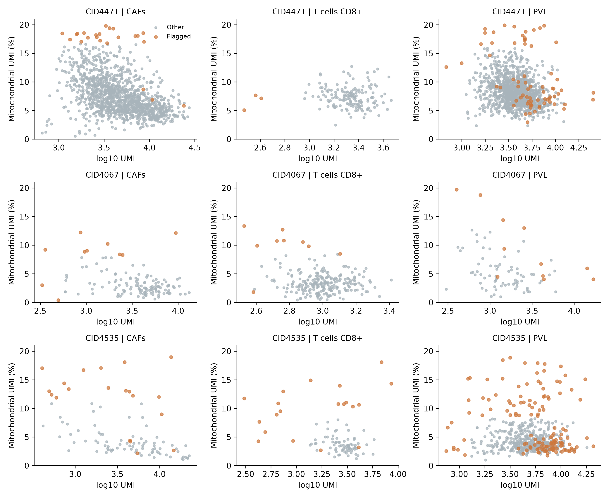
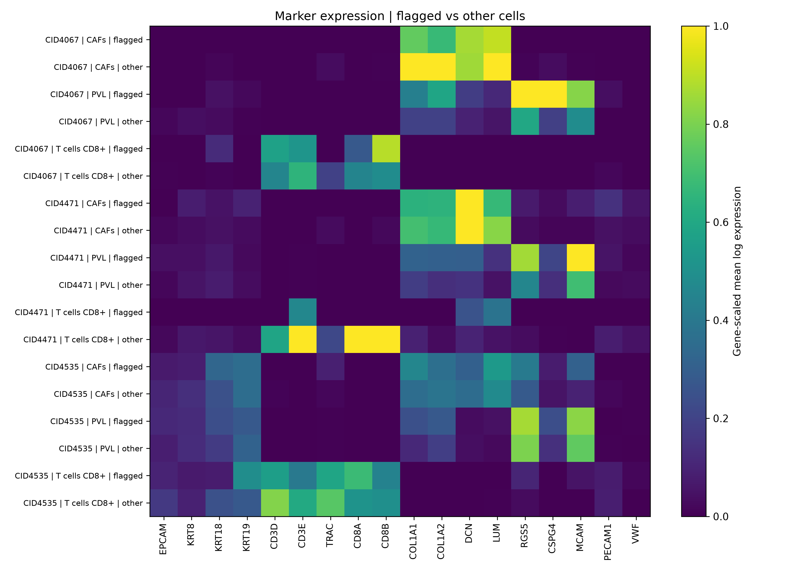

# 三例目标细胞复核记录

## 1. 本次查看的细胞

三例共有3,989个CAF、CD8 T和PVL细胞，其中303个带有QC或面板共表达标记。另查看内皮群和CID4535癌上皮的对应记录。

| 供者 | CAF总数/标记数 | CD8总数/标记数 | PVL总数/标记数 |
|---|---:|---:|---:|
| CID4471 | 1292/23 | 159/3 | 1285/71 |
| CID4067 | 135/10 | 243/9 | 83/11 |
| CID4535 | 102/20 | 98/20 | 592/136 |

## 2. 按实际数值查看标记

CID4067有8个CAF被同类MAD规则标记为高线粒体，这些细胞的实际比例为8.30%—12.23%。CID4535有56个PVL带同类标记，实际比例为8.67%—18.88%。MAD筛查记录的是每类内部的相对分布位置，本轮将实际数值和分组中位数一起保存。

CID4471的3个低计数CD8细胞分别位于295—406 UMI，检测基因数至少228；CID4067有3个低基因数CD8细胞，位于337—403 UMI；CID4535对应的9个细胞位于306—926 UMI。低计数组的marker检测更稀疏，逐基因原始计数已列出。

CID4535的两个上皮/T共表达CD8细胞，上皮面板分别为4和5 UMI，约占各自总UMI的0.097%和0.288%。这两例由低计数共表达触发面板规则，处理记录保留作者CD8标签。

CAF/PVL共同表达标记分布在CAF、PVL及内皮等群。对照组平均表达，带标记PVL中仍可见RGS5/CSPG4/MCAM表达，并伴随部分COL1A1/2等基质表达。原始面板计数和检测比例分别保存，便于区分单个低计数与群体平均表达。

CID4535的癌上皮中，有268个细胞带任一复核标记，其中263个触发低基因数规则。该群包含较宽的计数分布，本轮保留作者注释及低深度标记。

## 3. 本轮处理

本轮沿用作者筛选后的细胞及其标签，额外剔除0个细胞。303个目标标记细胞全部写入复核记录，分别标记low_depth、relative_mt_tail、high_depth和panel_coexpression。

固定按本轮保留记录继续准备参考输入。每个细胞的处理动作写在cell_review_decisions.csv，三个目标类型的条码与使用状态另存target_cell_use_table.csv。

## 4. 图和数据

表达图按全部参考类型的基因最大平均表达缩放。每个基因在不同组间使用同一色阶。

- flagged_cells_detail.csv：带标记目标细胞及辅助群的QC、作者注释与marker计数。
- flag_numeric_ranges.csv：各标记对应的实际数值范围。
- flagged_vs_other_qc.csv：带标记组与其他细胞的QC对照。
- flagged_vs_other_marker_mean.csv：平均log表达。
- flagged_vs_other_marker_detection.csv：检测比例。
- cell_review_decisions.csv：本轮处理记录。
- reference_counts_after_review.csv：处理后各参考类型数量。
- target_cell_use_table.csv：CAF、CD8 T和PVL逐细胞使用表。
